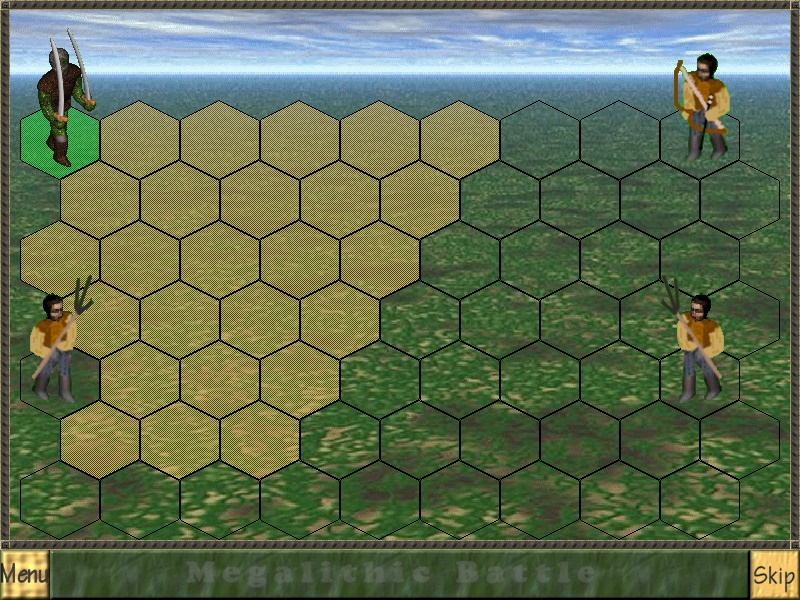
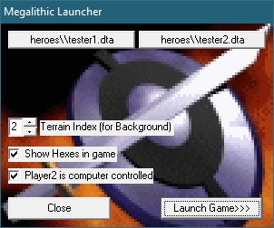
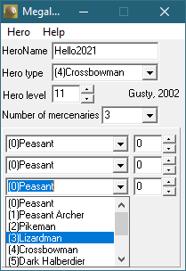
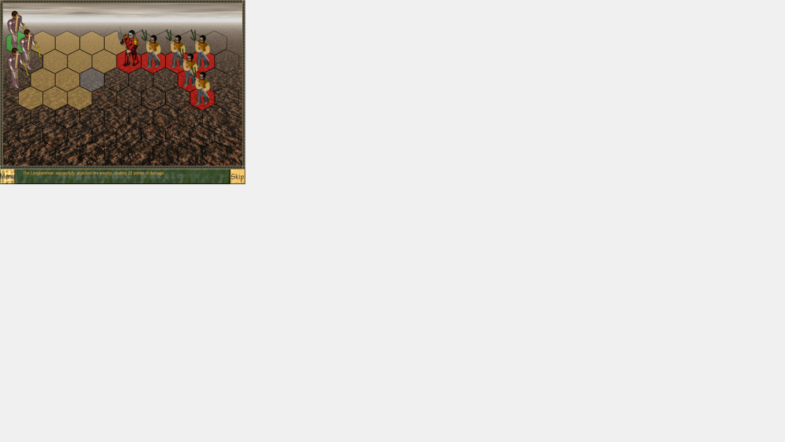
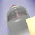

# MegaBattle 2

This is a small game, heavily inspired by the battle-part of Heroes of Might and Magic 3.

It was written back in 2002, with little C++ experience, before having internet access, so it's full of bad code.
It was developed using Borland C++ Builder, but if you can get your hand on a recent version, it should be able to build the project with minimal changes.

## How to play?

Use the Launcher, this will allow you to choose the terrain (basically: background picture) and the combating armies.
(Note: this stores data in `battle.ini`, so if the file cannot be written to, you may encounter errors).

From the launcher use the two top buttons to select the hero (and army) to use for each side.
This will open a dialog to select a file from the `heroes` subdirectory where the hero and army configuration is stored.

Launch the game with the `Launch Game >>>` button.

The actual game executable shall read the `battle.ini` file (note: not an actual INI file) and use it to configure the battle.
(Note: the game will try to write the battle result to battle.out in the same directory, so if the file cannot be written to, you may encounter errors.)
(Why? I could not figure out I could use program arguments and return codes, and had a plan to have some sort of campaign, chaining battles together)

The units on the map take turns to move and/or atack.

- Ranged units can atack from anywhere
- You may notice wild variations between the individual armies regarding units and their individual skills.
  - there is no balance
  - I don't even remember why that is.
- You cannot choose the direction from which you atack. Units will choose their (dumb) path to their target.

## Creating heroes for play

You can use the Hero Editor (`HeroEdit.exe`) to create new hero configurations or to edit existing ones.

⚠ Don't use space characters for your hero file name. E.g.

- "hero_2021.DTA" - ok ✔
- "hello 2021.DTA" - bad ❌

## Graphics

- Cursors
  - I don't recall 100%, but I'm pretty sure they're my creation
- 2D graphic textures
  - my own
  - mostly from 3D renderings done in 3DStudio Max
  - `_face dead.bmp` - originally a skull cropped from a random picture - replaced in 2021
    - apparently not even used :-)
- Sounds
  - initially taken from a random game, edited in GoldWave
  - replaced in 2021 with freesound versions, edited in Audacity
  - see [sounds](sounds/sounds.md) for more details

## Bugs

There are bugs!

🤦‍♂️the units may accidentally overlap!

❗ Also, the game does not use a fullscreen video mode. It will try to create a fullscreen sized window... BUT only the top-left corner of 800x600 shall be used. For instance, here's how it looks on a 2560x1440 screen.

Also, take care when editing the hero file names (in the `heroes` folder): if the file name contains any white space, the game fails to load it.

## Original Author

Augustin Preda, 2002

